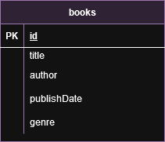

<p align="center">

<a  href="http://nestjs.com/"  target="blank"></a>

</p>

  
  

## UML diagram

  



  
  

## Description

  

[Nest](https://github.com/nestjs/nest) framework TypeScript starter repository.

  

## Project setup

  

```bash

$  npm  install

```

  

## Compile and run the project

  

```bash

# development

$  npm  run  start

  

# watch mode

$  npm  run  start:dev

  

# production mode

$  npm  run  start:prod

```

  

## Run tests

  

```bash

# unit tests

$  npm  run  test

  

# e2e tests

$  npm  run  test:e2e

  

# test coverage

$  npm  run  test:cov

```

  

## Running the Application 

Start the MongoDB container.

Start the NestJS application container.

Access the Application:
```bash
http://localhost:3000
```
